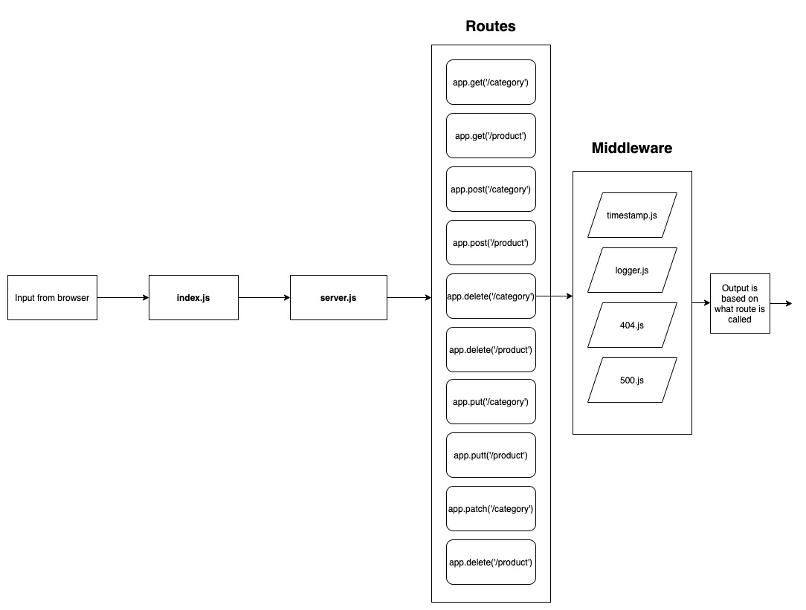

# LAB - Class 06

## Project: Project Name Here

### Author: Davee Sok

### Links and Resources

- [Lab 6 Pull Request](https://github.com/davee-401-advanced-javascript/api-server/pull/1)
- [Lab 7 Pull Request](https://github.com/davee-401-advanced-javascript/api-server/pull/2)
- [ci/cd](https://github.com/davee-401-advanced-javascript/api-server/actions) (GitHub Actions)
- [Swagger API Docs](https://app.swaggerhub.com/apis/daveeS987/serverAPI-Practice/0.1#/info)
<!-- - [back-end server url](http://xyz.com) (when applicable)
- [front-end application](http://xyz.com) (when applicable) -->

### Setup

#### `.env` requirements (where applicable)

<!-- - `MONGODB_URI` - URL to the running mongo instance/db -->

- Add the following into an .env file:

```
PORT = 3000
```

#### How to initialize/run your application (where applicable)

- e.g. `npm start`

#### How to use your library (where applicable)

#### Tests

- How do you run tests?
- Any tests of note?
- Describe any tests that you did not complete, skipped, etc

#### UML

Link to an image of the UML for your application and response to events


